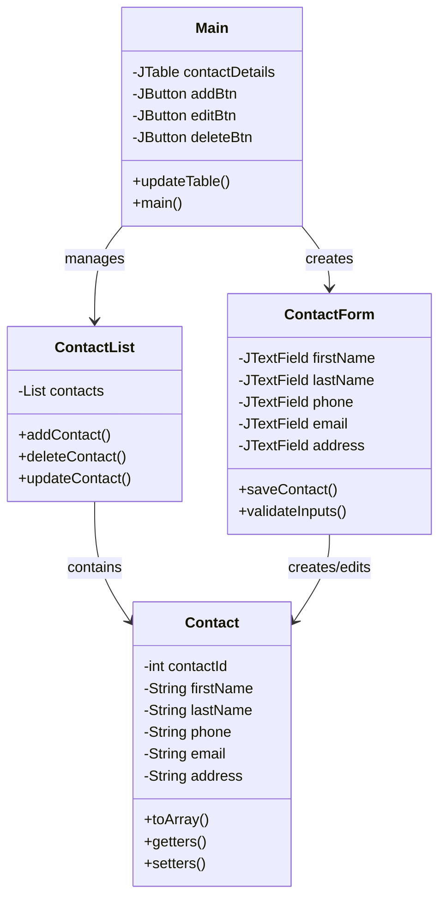

# JContactManager

A Java-based desktop application for managing personal and professional contacts with a user-friendly interface.


## 📋 Table of Contents
- [Features](#features)
- [Prerequisites](#prerequisites)
- [Installation](#installation)
- [Usage](#usage)
- [Project Structure](#project-structure)
- [Architecture](#architecture)
- [Contributing](#contributing)
- [License](#license)

## ✨ Features

- **Contact Management**
  - Add new contacts
  - Edit existing contacts
  - Delete contacts
  - View all contacts in a table format

- **Contact Information**
  - First Name
  - Last Name
  - Phone Number
  - Email Address
  - Physical Address

- **User Interface**
  - Modern Nimbus look and feel
  - Intuitive table view
  - Context-sensitive buttons
  - Confirmation dialogs for important actions

- **Data Persistence**
  - XML-based storage
  - Automatic saving on application close
  - Automatic loading on startup

## 🚀 Prerequisites

- Java Runtime Environment (JRE) 8 or higher
- NetBeans IDE (for development)
- Basic understanding of Java and Swing

## 💻 Installation

1. Clone the repository:
   ```bash
   git clone https://github.com/yourusername/JContactManager.git
   ```

2. Open the project in NetBeans IDE:
   - Launch NetBeans IDE
   - Go to File > Open Project
   - Navigate to the cloned directory
   - Select the project and click "Open"

3. Build the project:
   - Right-click on the project in NetBeans
   - Select "Clean and Build"

## 🎮 Usage

1. **Starting the Application**
   - Run the `Main.java` file
   - The main window will appear with an empty contact table

2. **Adding a Contact**
   - Click the "Add Contact" button
   - Fill in the contact details in the form
   - Click "Save" to add the contact

3. **Editing a Contact**
   - Select a contact from the table
   - Click the "Edit Contact" button
   - Modify the contact details
   - Click "Save" to update the contact

4. **Deleting a Contact**
   - Select a contact from the table
   - Click the "Delete Contact" button
   - Confirm the deletion in the dialog

## 📁 Project Structure

```
JContactManager/
├── src/
│   ├── Main.java                 # Main application window
│   ├── Main.form                 # Main window form design
│   ├── ContactForm.java          # Contact form window
│   ├── ContactForm.form          # Contact form design
│   ├── models/
│   │   ├── Contact.java          # Contact model class
│   │   └── ContactList.java      # Contact list management
│   └── util/
│       └── Util.java             # Utility functions
├── contacts.xml                  # Contact data storage
├── build.xml                     # Ant build script
└── manifest.mf                   # Application manifest
```

## 🏗️ Architecture

The application follows a simple MVC-like architecture:

- **Model**: `Contact` and `ContactList` classes
- **View**: Java Swing forms (`Main.form` and `ContactForm.form`)
- **Controller**: Business logic in `Main.java` and `ContactForm.java`

### Component Diagram


## 🤝 Contributing

1. Fork the repository
2. Create your feature branch (`git checkout -b feature/AmazingFeature`)
3. Commit your changes (`git commit -m 'Add some AmazingFeature'`)
4. Push to the branch (`git push origin feature/AmazingFeature`)
5. Open a Pull Request

